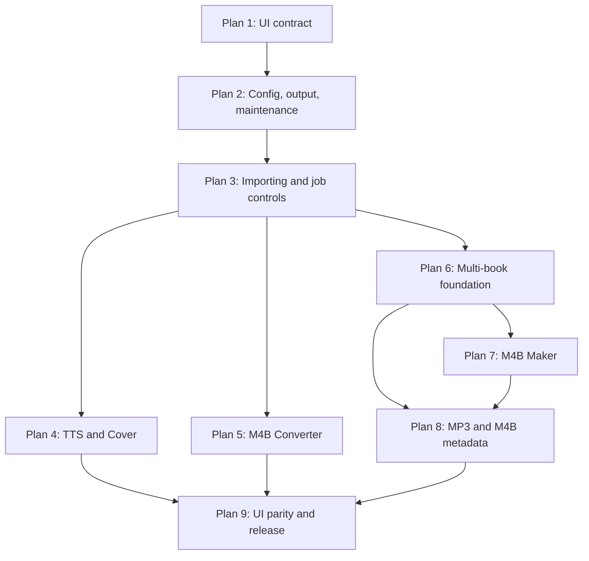

# Audiobook Creation Tool v0.6.x — Master Implementation-Plan Index

**Status:** Permanent planning and coordination index  
**Prepared:** 2026-08-03  
**Intended repository path:** `md-instructions/don't-delete/Audiobook-Creation-Tool-v0.6.x-Master-Implementation-Plan-Index.md`  
**Repository:** `elmatthe/audiobook-creation-tool`  
**Default branch:** `master` — do not substitute `main`  
**Current release version:** `0.5.1`; the v0.6.x work remains unreleased  
**Decision authority:** Confirmed Decisions 1–55 and the approved nine-plan series map

> This file is permanent. It is not an active instruction drop and must never be deleted during a drop closeout. It coordinates the complete v0.6.x program while each implementation drop supplies the detailed, phase-by-phase execution contract for one bounded plan.

## 1. Purpose

Use this index to orient ChatGPT, Claude, Claude Code, Codex, and future maintainers before drafting, implementing, reviewing, merging, or closing any v0.6.x plan. It establishes:

- the authoritative source order;
- the protected repository and documentation contracts;
- the approved nine-plan sequence and dependencies;
- the responsibilities assigned to each plan;
- cross-plan architecture, safety, test, UI, and release gates;
- current status and verified transition evidence; and
- the rule that only one active temporary implementation drop is executed at a time.

This index does not authorize implementation by itself. The active plan in `md-instructions/` is the execution authority for its own scope.

## 2. Authority and source order

When sources appear incomplete or inconsistent, apply them in this order:

1. The user's latest explicit instruction.
2. `AI-WORKSPACE.md` for repository-wide workflow and structure.
3. The locked requirements in `md-instructions/don't-delete/Audiobook-Creation-Tool-v0.6.x-Decision-Register-1-55.md`.
4. This master index for plan ownership, dependencies, permanent invariants, and current program status.
5. The currently active temporary implementation drop for phase-level execution.
6. `md-instructions/don't-delete/Audiobook-Creation-Tool-v0.6.x-Approved-Plan-Series-Map.md`.
7. The four current permanent repository documents, each only for its assigned role.
8. `md-instructions/don't-delete/Audiobook-Creation-Tool-v0.6.x-Planning-Handoff-2026-07-31.md` as historical planning context.
9. Source code, tests, Git history, approved evidence, and the current repository state.

If a genuine contradiction remains after applying that order, stop before editing and report the exact two conflicting statements, their paths, and the decision required. Do not restart the full requirements interview and do not silently choose one.

### Unavailable legacy planning file

`audiobook-creation-tool-new-version.md` is unavailable from the earlier chat and is not required to continue. It was an upstream planning input, not a present execution authority. Its confirmed requirements were consolidated into Decisions 1–55, the approved plan-series map, the final planning handoff, and the current permanent documents. Agents must not block a phase merely because that old file cannot be downloaded and must not invent a replacement history for it.

## 3. Permanent filename and deletion contract

The following four files must permanently retain these exact names and exact casing:

| Role | Canonical path |
|---|---|
| Project description and architecture | `md-instructions/Briefing.md` |
| Append-only change history | `md-instructions/Changelog.md` |
| Append-only architectural decisions | `md-instructions/Decisions.md` |
| Current working state and agent handoff | `md-instructions/Handoff.md` |

Claude Code, Codex, and every other agent must obey all of these rules:

- Never rename, recase, replace, delete, duplicate, or move any of the four files.
- Never recreate the old variants `CHANGELOG.md`, `DECISIONS.md`, or `handoff.md`.
- When updating a permanent document, edit the canonical path in place.
- Update `scripts/verify.py`, tests, plan text, and documentation references to the exact canonical casing.
- Add an automated repository-contract check that enumerates `md-instructions/` and fails if a canonical file is missing or any case-insensitive alias/duplicate exists. Do not rely on Windows' case-insensitive path resolution.
- Before every commit, inspect `git status --short` and `git diff --name-status` for accidental case-only renames.
- Never use a broad documentation cleanup, wildcard deletion, or case-normalization command in `md-instructions/`.

The `md-instructions/don't-delete/` directory is also permanent. At minimum, it contains the approved plan-series map, Decision Register 1–55, final planning handoff, and this master index. Do not delete or move those references during any active-drop closeout.

Only the specifically named active temporary implementation drop may be deleted, and only in that drop's final approved closeout phase after its permanent decisions and state have been transferred to the four canonical documents.

## 4. Repository baseline and Plan 1 transition

As verified on 2026-08-03:

- The repository default branch is `master`.
- Pull request #2, **Feature/0.6.0 drop1 windows UI prototype**, is merged.
- Plan 1 feature head: `f3d70e8c9017f2fec3ae459c1438dd71b42f9ef0`.
- Plan 1 merge commit: `86933e6510c6303cadf3437dc295d000ffa9ee82`.
- The observed current `master` head after the documentation-name upload was `bada8a3dee87acf6a6619252bd31cdee429f1711`.
- The current head contains the canonical four filenames and the three permanent planning references in `md-instructions/don't-delete/`.
- Plan 1 remains approved and closed; its version was not released or bumped.
- The ten approved Plan 1 screenshots remain under `files/UI-Prototype-Screenshots/v0.6.0-drop1/` and must not be reshot or altered by an unrelated plan.
- The Plan 1 feature branch must not be deleted unless the user separately authorizes branch cleanup.

The observed `master` SHA is orientation evidence, not permission to overwrite a newer branch. Every new plan must fetch and record the actual current `origin/master`, confirm it descends from the Plan 1 merge, and branch from that verified head.

The user's local root `config-template.toml` is an unrelated, pre-existing untracked workspace item. It is not the Plan 2 `config.toml`. Preserve it exactly: do not edit, stage, commit, rename, delete, copy over, or use it as a bulk-replacement target.

## 5. Program status

| Plan | Release checkpoint | Temporary drop | Status | Depends on |
|---:|---|---|---|---|
| 1 | v0.6.0 Drop 1 | `0.6.0-drop1-windows-ui-prototype.md` | **Complete, approved, and merged through PR #2** | v0.5.1 baseline |
| 2 | v0.6.0 Drop 2 | `0.6.0-drop2-config-output-maintenance-foundation.md` | **Approved and in progress — Phase 0 complete 2026-08-03; Phases 1–9 pending maintainer approval.** Branch `feature/0.6.0-drop2-config-output-maintenance-foundation`, start SHA `bada8a3dee87acf6a6619252bd31cdee429f1711` | Plan 1 |
| 3 | v0.6.0 Drop 3 | `0.6.0-drop3-shared-job-controls-importing.md` | Planned; not drafted | Plans 1–2 |
| 4 | v0.6.1 | `0.6.1-tts-cover-workflows.md` | Planned; not drafted | Plans 1–3 |
| 5 | v0.6.2 | `0.6.2-m4b-converter-upgrade.md` | Planned; not drafted | Plans 1–3 |
| 6 | v0.6.3 Drop 1 | `0.6.3-drop1-shared-multi-book-workspace.md` | Planned; not drafted | Plans 1–3 |
| 7 | v0.6.3 Drop 2 | `0.6.3-drop2-m4b-maker-multi-book.md` | Planned; not drafted | Plans 1–3 and 6 |
| 8 | v0.6.4 | `0.6.4-mp3-and-m4b-metadata-workflows.md` | Planned; not drafted | Plans 1–3 and 6; Plan 7 validates the shared model first |
| 9 | v0.6.5 | `0.6.5-ui-parity-hardening-release.md` | Planned; not drafted | Plans 1–8 |

Do not draft or implement Plans 3–9 while Plan 2 is active. A later plan may be drafted only after the current plan is implemented, verified, manually approved, documented, merged through the established workflow, and closed.

## 6. Dependency and release sequence

Plans 1–3 form the v0.6.0 shared-foundation checkpoint. Plan 2 alone must not bump the version, create a v0.6.0 release heading, tag, build a release, or claim v0.6.0 shipped. Release timing is controlled by the later approved drop and final release gate.

## 7. Plan ownership

### Plan 1 — approved Windows design contract

Owns the Windows semantic tokens, `ACT.*` namespaced ttk isolation, converted launcher shell, converted M4B Metadata Editor prototype, and approved visual evidence. It deliberately leaves five panels classic on Windows. Later plans may use the approved primitives but must not reopen the prototype approval.

### Plan 2 — configuration, output, and application maintenance

Owns:

- committed root `config.toml`, schema, validation, warnings, and packaging;
- precedence of code defaults, TOML, and allowlisted mutable settings;
- user-configurable output base;
- atomic unique tool/run-directory and collision-safe path services;
- flat individual-file output and mirrored folder-root planning rules;
- the Cover Image and M4B Maker destination exceptions;
- Preferences UI, Reset Preferences, itemized Clear Downloaded Data, and safe post-exit cleanup;
- the permanent filename regression gate required by Section 3.

It does not own recursive scanning UI, shared imported-file managers, Pause/Resume, ETA, Retry Failed, or multi-book behavior.

### Plan 3 — shared importing and job-control foundation

Owns the reusable importer, background atomic scans, traversal, deduplication, link/hidden/unreadable rules, large-root warnings, frozen run snapshots, input locking, Pause/Resume state model, Summary/Details behavior, ETA, and Retry Failed contracts. It consumes Plan 2 path and configuration services rather than creating parallel ones.

### Plan 4 — TTS and Cover workflows

Adopts Plans 2–3 in TTS and Cover Image. TTS folder batch remains PDF/TXT only and must not rewrite the Edge batch timing engine. Cover adds its approved browser views, folder flow, HEIC/HEIF capability, and fully exercises Plan 2's source-side output exception.

### Plan 5 — M4B Converter

Owns whole-book/split behavior, full-timeline chapter splitting, chapterless fallback, output naming, and Preserve/Strip/Replace metadata rules. It consumes Plan 2 collision/mirroring services and Plan 3 controls.

### Plan 6 — multi-book foundation

Owns book-job data models, navigation, Add/Duplicate/Remove, shared metadata precedence, frozen effective values, success-only numbering, and shared retry/removal-confirmation behavior.

### Plan 7 — M4B Maker

Adopts the multi-book foundation and implements per-book MP3 inputs, output filenames, metadata, covers, silence, shared-series numbering, continue-on-failure, and retry. It completes the functional consumer of Plan 2's M4B Maker custom-destination exception.

### Plan 8 — MP3 Tool and M4B Metadata Editor

Owns the simplified MP3 Combine/Bulk ID3 workflows, multi-book processing, majority metadata rules, embedded-artwork removal, signed Time behavior, and one independent prefilled page per M4B plus Shared Metadata.

### Plan 9 — visual parity, hardening, packaging, and release

Owns conversion of all remaining Windows panels, macOS feature parity, final scaling/layout/accessibility review, full regression and long-run drills, release-package launch testing, documentation, versioning, tagging, and release approval.

## 8. Shared architecture contract

All plans extend the current shared Python/tkinter architecture. Do not rebuild the application around a new toolkit or create parallel platform implementations without an expressly approved contradiction.

| Layer | Responsibility | Primary ownership |
|---|---|---|
| Root launchers and stdlib bootstrap | First run, repair, pre-venv operations, post-exit maintenance coordination | Plans 2 and 9 |
| Shared platform-neutral services | Config, settings, paths/output, cancellation, jobs/importing, metadata | Plans 2, 3, and 6 |
| Shared UI system | Platform selection, Windows `ACT.*` styles, macOS native appearance, dialogs, progress | Plans 1 and 9; intermediate plans may extend narrowly |
| Tool panels | Tool-specific state, validation, worker wiring, user choices | Plans 4, 5, 7, and 8 |
| Verification and release | Tests, `verify.py`, packaging, setup/launch evidence, documentation | Every plan; final ownership in Plan 9 |

Rules:

- Business logic must be testable without Tk and platform-neutral unless it truly coordinates an OS launcher.
- Tk widgets are touched only on the main thread; workers communicate through the existing queue/callback pattern.
- Existing cancellation/progress/threading foundations are extended, not replaced.
- Never silently overwrite an input or output.
- Never follow links/junctions during folder traversal.
- Preserve native macOS/Finder presentation while adding feature parity.
- Preserve the Plan 1 `ACT.*` style-isolation contract until Plan 9 intentionally converts the remaining panels.
- Keep `MIN_SIZE = (920, 600)` and `DEFAULT_GEOMETRY = (1024, 720)` unless a later expressly scoped, evidence-backed decision supersedes them.

## 9. Global GUI fit and scrolling acceptance contract

This requirement is binding for all new UI immediately and for the complete application at the end of Plan 9.

### Meaning of full screen

For this project, "full screen" means the normal application window maximized through the operating system. It does not require an F11-style borderless mode and does not change the existing default startup geometry or force automatic maximization.

### Final maximized-view requirement

At the Plan 9 reference environments—Windows 11 at 1920×1080 with both 100% and 125% display scaling, plus the approved live macOS reference display—the maximized launcher must show each complete tool view without a whole-panel or whole-form scrollbar when practical. The user must be able to see the tool's bounded configuration sections, primary actions, run controls, progress/status, and output location in that maximized view.

Use adaptive layout before scrolling: responsive columns, compact spacing, wrapping, collapsible secondary material, and local list sizing. Do not solve ordinary fixed-form layout by placing the entire tool inside a permanently scrolling canvas.

### Scrolling that remains valid

Scrolling is allowed for genuinely unbounded or variable-length content, including:

- imported-file lists and book/job collections;
- chapter-title collections or long metadata/result details;
- Summary/Details logs and diagnostic output;
- thumbnail/list browsers whose contents grow with user input; and
- overflow below the supported minimum size or under an environment outside the tested reference matrix.

When scrolling is needed, keep it local to the content region. Primary actions, Cancel/Pause/Resume where applicable, progress, status, and output access remain visible or immediately reachable.

### Minimum-size behavior

At `920×600`, no plan may promise that every variable-length section is simultaneously visible. The acceptance requirement is graceful adaptation: no inaccessible primary action, no unresolvable overlap, no clipped confirmation button, and local scrolling only where necessary.

### Ownership of current exceptions

- Plan 1's approved M4B Metadata Editor form currently scrolls at every size. That remains an accepted Plan 1 limitation, not the final v0.6.x target. Plan 9 must redesign or reflow it so the fixed form does not require whole-form scrolling when maximized, while local chapter/file/log scrolling remains allowed.
- The M4B Converter's clipping at the `920×600` minimum remains deferred to its Plan 9 visual conversion unless Plan 5 must touch the exact layout for its scoped workflow.
- Windows DPI awareness remains unresolved and belongs to Plan 9 or another expressly scoped approved plan.

Every plan that adds a dialog or panel must include automated geometry/state tests where practical and maximized manual screenshots or recorded checks on the affected platforms. Plan 9 owns the final every-tool matrix.

## 10. Global safety and data-preservation rules

- Work on a feature branch created from a clean, current `origin/master`.
- Preserve unrelated user changes. Never reset, stash, clean, delete, or overwrite them to make a phase convenient.
- Preserve the local untracked `config-template.toml` exactly.
- Never edit input media in place except the explicit Cover Image replace-original mode, which must be off by default and strongly confirmed.
- Never include user outputs, settings, source code, docs, system Python, system package-manager installs, or system ffmpeg in Clear Downloaded Data.
- Cleanup accepts enumerated asset identifiers, not arbitrary paths, and performs canonical path/containment/link checks.
- Tests for deletion use temporary fake roots. A real `.venv` deletion/rebuild test requires a disposable clone or explicit user-approved manual test.
- No AI co-author trailers in commits.
- Do not squash, rewrite, or discard approved phase history unless repository instructions and the user explicitly require it.
- Do not merge an implementation branch until the entire drop passes its Definition of Done and the user explicitly approves integration.
- Do not delete feature branches as part of an ordinary plan closeout.

## 11. Global phase workflow

Every active drop must contain small numbered phases. For each phase:

1. Re-read the active drop and current `Handoff.md`.
2. Reconcile branch, remote, worktree, and prior phase SHA.
3. Implement only that phase.
4. Run focused tests and the full required verification gate.
5. Update `md-instructions/Handoff.md` with exact evidence and next state.
6. Update other permanent documents only when their assigned content changed.
7. Inspect diffs, including filename casing and unrelated paths.
8. Commit and push only the completed phase to the implementation branch when the workflow authorizes it.
9. Return the required phase summary and stop.
10. Wait for explicit user approval before beginning the next phase.

The phase summary must state:

- phase completed;
- files changed and approximate line counts;
- changes, reasons, and deviations;
- focused and full test results, skips, warnings, and `verify.py` result;
- manual actions still required;
- commit SHA and remote alignment when a commit was made; and
- the next phase, without starting it.

## 12. Cross-plan verification gates

Each phase's active drop may add stricter checks, but never remove these:

- focused unit/integration tests for changed behavior;
- full `pytest` suite with no unexplained loss of collected tests;
- `python scripts/verify.py` reporting `RESULT: PASS`;
- `python -m compileall` for changed Python scope or the repository's established compile gate;
- `git diff --check`;
- exact canonical documentation filename check;
- platform-neutral tests with temporary directories for filesystem/config/cleanup behavior;
- manual tests for affected UI and external-tool behavior;
- release archive content and clean extraction launch tests whenever packaging changes;
- explicit preservation of existing output/input safety and the Plan 1 style-isolation contract.

Skipped tests must be named and justified. Live macOS work may not be described as passed unless it ran on a real Mac. A user-approved deferral must be recorded as a deferral, not a pass.

## 13. Documentation ownership and closeout

During implementation:

- `Briefing.md` describes the lasting architecture and shipped/current features.
- `Changelog.md` records user-visible and important internal changes under `[Unreleased]` until release.
- `Decisions.md` records signed, dated, non-obvious architectural choices, newest first; it is append-only.
- `Handoff.md` records the detailed live state, evidence, SHAs, manual gates, blockers, and next action.
- This master index records program-level status, dependencies, and cross-plan contracts.

At a plan's final closeout:

1. Confirm every Definition-of-Done item with evidence.
2. Obtain explicit user approval of all manual gates.
3. Transfer lasting facts to the correct permanent documents.
4. Update this index's status row without changing the nine-plan structure unless a genuine dependency decision was approved.
5. Delete only the completed active drop.
6. Run the full verification gate again.
7. Commit/push the closeout on the feature branch.
8. Stop for integration approval; do not merge or start the next plan in the same phase.

## 14. Carried-forward limitations and issue ownership

Do not absorb these into an unrelated plan:

| Limitation | Current owner or disposition |
|---|---|
| Windows process DPI awareness unresolved | Plan 9 or separately approved plan |
| Live macOS validation of the v0.6.0 Plan 1 line deferred | Preserve as deferral; affected later work needs live evidence |
| M4B Converter clips at `920×600` | Plan 9 conversion unless Plan 5 necessarily touches it |
| Five panels remain classic on Windows | Plan 9 |
| ttk Combobox popdown and Windows title bar unthemed | Plan 9 review; may remain OS-owned if documented |
| M4B Metadata Editor form scrolls at every size | Plan 9 must address maximized whole-form scrolling |
| `verify.py` skipped-suite detection blind spot | A separately scoped verification fix or the earliest plan that safely owns the gate; do not misreport skips |
| Launcher status does not follow individual tool runs | Later job-control/UI work, not Plan 2 |
| Unreadable metadata input may be copied before tag write fails | Plan 8 or targeted bug plan |
| Open Issue #2: CLI-only `kokoro_synth.py` cp1252 `UnicodeEncodeError` | Separate issue; do not fold into Plan 2 |

## 15. Immediate next action

The next active document is:

`md-instructions/0.6.0-drop2-config-output-maintenance-foundation.md`

Plan 2 begins from the latest verified `origin/master`, on its own feature branch, after the user approves the drop. It must not be developed on the old Plan 1 feature branch, must not reopen Decisions 1–55, and must not begin Plan 3.

### Plan 2 recorded start state (2026-08-03, Phase 0)

| Field | Value |
|---|---|
| Branch | `feature/0.6.0-drop2-config-output-maintenance-foundation` (new; did not previously exist locally or on `origin`) |
| Start SHA / `origin/master` at fetch | `bada8a3dee87acf6a6619252bd31cdee429f1711` |
| Local `master` | fast-forwarded `1da1e547…` → `bada8a3…` with `--ff-only`; equal to `origin/master` |
| Plan 1 merge in ancestry | `86933e6510c6303cadf3437dc295d000ffa9ee82` — confirmed |
| Plan 1 feature head reachable | `f3d70e8c9017f2fec3ae459c1438dd71b42f9ef0` — confirmed; branch retained on `origin` |
| Baseline test result | 97 collected; 94 passed, 3 skipped, 1 warning; theme suite 17/17 executed |
| `scripts/verify.py` | `RESULT: PASS` — with the recorded pre-existing `CHANGELOG.md` casing defect at `verify.py:34`, masked only by case-insensitive Windows paths; Phase 1 fixes the reference, never the filename |
| Phase reached | Phase 0 complete; Phase 1 pending explicit maintainer approval |

Full evidence lives in `md-instructions/Handoff.md` (Current Focus + Session Sync Log).

