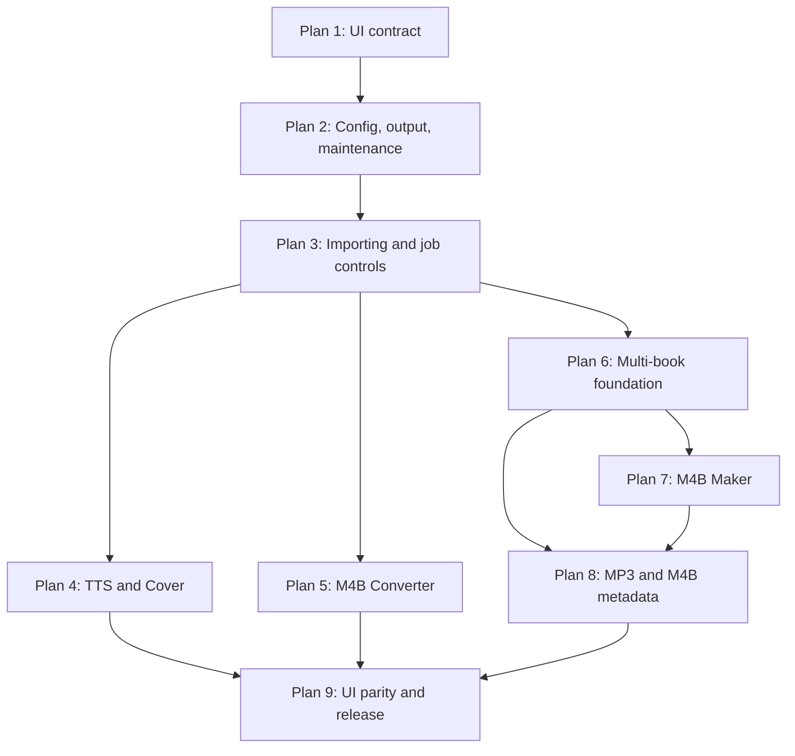

# Audiobook Creation Tool v0.6.x — Master Implementation-Plan Index

**Status:** Permanent planning and coordination index  
**Prepared:** 2026-08-03  
**Intended repository path:** `md-instructions/don't-delete/Audiobook-Creation-Tool-v0.6.x-Master-Implementation-Plan-Index.md`  
**Repository:** `elmatthe/audiobook-creation-tool`  
**Default branch:** `master` — do not substitute `main`  
**Current release version:** `0.5.1`; the v0.6.x work remains unreleased  
**Decision authority:** Confirmed Decisions 1–55 and the approved nine-plan series map

> This file is permanent. It is not an active instruction drop and must never be deleted during a drop closeout. It coordinates the complete v0.6.x program while each implementation drop supplies the detailed, phase-by-phase execution contract for one bounded plan.

## 1. Purpose

Use this index to orient ChatGPT, Claude, Claude Code, Codex, and future maintainers before drafting, implementing, reviewing, merging, or closing any v0.6.x plan. It establishes:

- the authoritative source order;
- the protected repository and documentation contracts;
- the approved nine-plan sequence and dependencies;
- the responsibilities assigned to each plan;
- cross-plan architecture, safety, test, UI, and release gates;
- current status and verified transition evidence; and
- the rule that only one active temporary implementation drop is executed at a time.

This index does not authorize implementation by itself. The active plan in `md-instructions/` is the execution authority for its own scope.

## 2. Authority and source order

When sources appear incomplete or inconsistent, apply them in this order:

1. The user's latest explicit instruction.
2. `AI-WORKSPACE.md` for repository-wide workflow and structure.
3. The locked requirements in `md-instructions/don't-delete/Audiobook-Creation-Tool-v0.6.x-Decision-Register-1-55.md`.
4. This master index for plan ownership, dependencies, permanent invariants, and current program status.
5. The currently active temporary implementation drop for phase-level execution.
6. `md-instructions/don't-delete/Audiobook-Creation-Tool-v0.6.x-Approved-Plan-Series-Map.md`.
7. The four current permanent repository documents, each only for its assigned role.
8. `md-instructions/don't-delete/Audiobook-Creation-Tool-v0.6.x-Planning-Handoff-2026-07-31.md` as historical planning context.
9. Source code, tests, Git history, approved evidence, and the current repository state.

If a genuine contradiction remains after applying that order, stop before editing and report the exact two conflicting statements, their paths, and the decision required. Do not restart the full requirements interview and do not silently choose one.

### Unavailable legacy planning file

`audiobook-creation-tool-new-version.md` is unavailable from the earlier chat and is not required to continue. It was an upstream planning input, not a present execution authority. Its confirmed requirements were consolidated into Decisions 1–55, the approved plan-series map, the final planning handoff, and the current permanent documents. Agents must not block a phase merely because that old file cannot be downloaded and must not invent a replacement history for it.

## 3. Permanent filename and deletion contract

The following four files must permanently retain these exact names and exact casing:

| Role | Canonical path |
|---|---|
| Project description and architecture | `md-instructions/Briefing.md` |
| Append-only change history | `md-instructions/Changelog.md` |
| Append-only architectural decisions | `md-instructions/Decisions.md` |
| Current working state and agent handoff | `md-instructions/Handoff.md` |

Claude Code, Codex, and every other agent must obey all of these rules:

- Never rename, recase, replace, delete, duplicate, or move any of the four files.
- Never recreate the old variants `CHANGELOG.md`, `DECISIONS.md`, or `handoff.md`.
- When updating a permanent document, edit the canonical path in place.
- Update `scripts/verify.py`, tests, plan text, and documentation references to the exact canonical casing.
- Add an automated repository-contract check that enumerates `md-instructions/` and fails if a canonical file is missing or any case-insensitive alias/duplicate exists. Do not rely on Windows' case-insensitive path resolution.
- Before every commit, inspect `git status --short` and `git diff --name-status` for accidental case-only renames.
- Never use a broad documentation cleanup, wildcard deletion, or case-normalization command in `md-instructions/`.

The `md-instructions/don't-delete/` directory is also permanent. At minimum, it contains the approved plan-series map, Decision Register 1–55, final planning handoff, and this master index. Do not delete or move those references during any active-drop closeout.

Only the specifically named active temporary implementation drop may be deleted, and only in that drop's final approved closeout phase after its permanent decisions and state have been transferred to the four canonical documents.

## 4. Repository baseline and Plan 1 transition

As verified on 2026-08-03:

- The repository default branch is `master`.
- Pull request #2, **Feature/0.6.0 drop1 windows UI prototype**, is merged.
- Plan 1 feature head: `f3d70e8c9017f2fec3ae459c1438dd71b42f9ef0`.
- Plan 1 merge commit: `86933e6510c6303cadf3437dc295d000ffa9ee82`.
- The observed current `master` head after the documentation-name upload was `bada8a3dee87acf6a6619252bd31cdee429f1711`.
- The current head contains the canonical four filenames and the three permanent planning references in `md-instructions/don't-delete/`.
- Plan 1 remains approved and closed; its version was not released or bumped.
- The ten approved Plan 1 screenshots remain under `files/UI-Prototype-Screenshots/v0.6.0-drop1/` and must not be reshot or altered by an unrelated plan.
- The Plan 1 feature branch must not be deleted unless the user separately authorizes branch cleanup.

The observed `master` SHA is orientation evidence, not permission to overwrite a newer branch. Every new plan must fetch and record the actual current `origin/master`, confirm it descends from the Plan 1 merge, and branch from that verified head.

### Plan 2 merge and the Plan 3 transition (verified 2026-08-08)

- Pull request #3, merging `feature/0.6.0-drop2-config-output-maintenance-foundation`, is merged.
- Current `origin/master`: `563df9884497032e19abd4437a0e66584cd9ec12` — the PR #3 merge commit, parents `bada8a3dee87acf6a6619252bd31cdee429f1711` and `c6fcac7b7469e36cb0d81de2cc524f46cec31bb7`.
- Drop 2 feature head: `c6fcac7b7469e36cb0d81de2cc524f46cec31bb7`; approved Drop 2 Phase 8: `0e7ad0c264cb2a46f3c64f968e24f00963cb1987`. Both are ancestors of `origin/master`, alongside the two Plan 1 SHAs above.
- Both feature branches are retained on `origin` and were not deleted.
- PR #3's merge message body reuses Drop 2 **Phase 0**'s title. That metadata is stale; the merge content and ancestry are correct. Record it accurately and do not rewrite the merge commit.
- Version remains `0.5.1`; the v0.6.x line is still unreleased.

### Root `config-template.toml` — current contract: ABSENT

**Supersedes** the previous instruction in this section (and in Section 10) to preserve the maintainer's local untracked `config-template.toml`. On 2026-08-08 the maintainer removed that file from the HOME-PC repository and directed that the Plan 3 line keep it gone. The current rule for every agent is:

- The physical repository-root `config-template.toml` must be **absent** and stay absent.
- Never recreate, restore, stage, commit, package, load, copy from, or use it as a source for `config.toml`.
- Before any removal, prove the target is exactly the repository-root path and is **not tracked**. If Git reports it as tracked, stop and report the contradiction rather than deleting it.
- Never use `git clean`, a wildcard, or a recursive deletion, and never remove a similarly named file elsewhere. Do not add an ignore rule that could conceal a future tracked regression.
- Source and tests may keep the string as a defensive protected/forbidden filename. The instruction removes the local file, not the guards that keep it out of runtime loading and release archives.
- Verified at Plan 3 Phase 0 (2026-08-08): already absent from the worktree, the index and the `origin/master` tree; no removal was necessary and none was performed.

*Superseded (kept for the record): this section previously read "The user's local root `config-template.toml` is an unrelated, pre-existing untracked workspace item. It is not the Plan 2 `config.toml`. Preserve it exactly: do not edit, stage, commit, rename, delete, copy over, or use it as a bulk-replacement target." That was accurate for the whole of Plan 2 and remains accurate as history.*

## 5. Program status

| Plan | Release checkpoint | Temporary drop | Status | Depends on |
|---:|---|---|---|---|
| 1 | v0.6.0 Drop 1 | `0.6.0-drop1-windows-ui-prototype.md` | **Complete, approved, and merged through PR #2** | v0.5.1 baseline |
| 2 | v0.6.0 Drop 2 | *(retired at closeout)* | **Complete, maintainer-approved 2026-08-08, and MERGED through pull request #3** as merge commit `563df9884497032e19abd4437a0e66584cd9ec12`. All ten phases done; Phase 8 approved at `0e7ad0c264cb2a46f3c64f968e24f00963cb1987`; Phase 9 transferred the lasting record and retired the temporary drop. Branch `feature/0.6.0-drop2-config-output-maintenance-foundation` retained at `c6fcac7b7469e36cb0d81de2cc524f46cec31bb7`, start SHA `bada8a3dee87acf6a6619252bd31cdee429f1711`. Evidence: twelve 100% images under `files/UI-Prototype-Screenshots/v0.6.0-drop2/`; Windows matrix 46/46 PASS after a recorded 44/46 first pass and two fixes. **Deferred, not passed:** live macOS, and the Windows 125% matrix (held for the later UI-compression/no-scroll phase). No version bump, tag or release. | Plan 1 |
| 3 | v0.6.0 Drop 3 | *(retired at closeout)* | **Complete, maintainer-approved 2026-08-10, closed out, and MERGED into `master` through pull request #4** (merge `809a43e754920fce2f11f08e3c401dcc4c7a5223`); branch `feature/0.6.0-drop3-shared-job-controls-importing` retained. *(Superseded status text, kept for the record: this row previously read "awaiting integration review; NOT merged", and before that* **ACTIVE — Phases 0-7 complete (Phases 0-2 on 2026-08-08, Phases 3-6 on 2026-08-09, Phase 7 on 2026-08-10).** Branch `feature/0.6.0-drop3-shared-job-controls-importing`, start SHA `563df9884497032e19abd4437a0e66584cd9ec12`. Phase 1 added the frozen importing/job-control vocabulary (`shared/importing.py`, `shared/job_control.py`) and 307 tests, and repaired the Phase 0 baseline defect under approved option (a). Phase 2 added the read-only traversal core — natural ordering, broad-root classification, hidden detection, non-following identity capture and `scan_roots` — plus 97 tests; its link-classification risk gate was reached, evidenced and cleared, and `maintenance.py` was **not** refactored. Phase 3 added the imported-file manager, Add Files validation, deduplication by non-following source identity, the deliberate-duplicate override and atomic transactions — plus 146 tests; its `output_paths.py` compatibility gate was **not encountered**, and `output_paths.py`, `maintenance.py` and `shared/cancellation.py` are all byte-identical to the Phase 2 commit. Phase 4 added the background coordination layer in a new pure companion module `shared/import_coordination.py` — one operation at a time, the broad-root warning before any worker, a bounded queue of frozen events, owner-thread fencing on every manager-touching entry point, the captured >1,000 threshold confirmation and atomic commit with bounded stale-revision recomputation — plus 129 tests; its cancellation isolation gate was **not encountered**, and `shared/cancellation.py` remains byte-identical. Phase 5 added the cooperative run controller to `shared/job_control.py` — the frozen transition table enforced in one place, condition-based pause waiting, resume, cancel wake-up, one acknowledgement per run and deterministic terminal settlement — plus one additive predicate in `shared/cancellation.py` and 173 tests; its compatibility gate was **not encountered**, `ConversionCancelled` and `raise_if_cancelled` are unchanged, and every pre-existing caller passes untouched. Phase 6 added run framing to `shared/job_control.py` — `capture_run`, the UI-neutral lock derivation, and the `ItemStatus`/`ItemOutcome`/`RunResult` disposition layer that builds Retry Failed from only retryable failures against the exact original snapshot — plus 174 tests; its risk gate was honoured by omission, so no output descriptor exists and Plan 2 keeps sole ownership of placement. Phase 7 added the reporting layer to the same module — typed production whose state-bearing events are minted from the controller's own snapshot, a stream that rejects stale, unknown-item, post-terminal and duplicate-terminal events inertly, Summary/Details projections whose Summary structurally cannot read the technical `detail` field, a lazy bridge to the one existing session logger, a progress contract that is never rounded up to meet a happy ending, and a current-run rolling ETA with an injected clock, a three-sample minimum, a twenty-sample window, precise pause exclusion and `Calculating…` for every unreliable case — plus 258 tests; no mandatory gate was encountered, no approved Phase 1–6 contract was rewritten, and `logging_setup.py` and `ui_theme.py` are byte-identical. Adopted by no production panel. Phases 8–10 not started; each needs separate explicit maintainer approval. See the recorded start state in Section 15.*) All ten phases are done; Phase 9's Windows manual matrix was explicitly approved, Phase 10 transferred the lasting record and retired the temporary drop, and the automated gate was **2,534 collected / 2,521 passed / 13 skipped / 1 warning** both before and after that retirement. Plan 4 has since been built on top of this foundation and adopts it in two production panels. | Plans 1–2 |
| 4 | v0.6.1 | *(retired at closeout)* | **COMPLETE, maintainer-approved, CLOSED, and MERGED into `master` through pull request #5** (merge `81c9c0600ca74a42a22bd09d367a702bee9708fe`, a normal merge commit; parent 1 `809a43e`, parent 2 the approved feature head `07d21545d4f5d0bce7b548a437ba6bf1dff71d19`); branch `feature/0.6.1-tts-cover-workflows` retained. *(Superseded status text, kept for the record: this row previously read "awaiting integration review; NOT merged".)* All sixteen phases (0–15) done and separately approved, on branch `feature/0.6.1-tts-cover-workflows` from start SHA `809a43e754920fce2f11f08e3c401dcc4c7a5223`. Delivered: the **unified PDF/TXT queue** in TTS; the **retirement of EPUB** from production with its source preserved in the permanent tracked archive `files/archived-code/epub-tts/` (a **breaking change**, and the archive is **not** a temporary drop); the Cover **Details / List / Medium Thumbnail** browser; **HEIC/HEIF** capability with decode and encode reported separately and **format preserved, never silently substituted with JPEG**; the **Chatterbox** engine (`ResembleAI/chatterbox-turbo` via `chatterbox-tts==0.1.7`) with **four maintainer-authorized voices**, **CPU-first** device selection and a truthful degraded path; and shared importer / output-service / job-control adoption in both panels. `launcher.TOOLS` still holds exactly six tools. **Evidence:** the Windows manual matrix is **COMPLETE and explicitly approved** (2026-08-19, HOME-PC, 1920×1080 at 100%) after five root-caused defects; **live macOS is a PASS, not a deferral** (2026-08-20/21, Apple M4 Pro, macOS 26.5.2, native arm64) including **genuine HEIC 12/12** and all four Chatterbox voices on **real Metal**, approved by ear on 2026-08-21; Phase 14 approved 2026-08-22 on its 14D evidence, having found and fixed a real wheel-binding lifecycle defect in `shared/ui_theme.py` and closed a test-harness hole where a failed Tk root became a silent skip; automated gate **3901 collected, 3887 passed, 0 failed, 0 errors, 14 skipped, 1 warning**, **zero Tk/display skips**, `verify.py` **RESULT: PASS**, compile exit 0 — identical **before and after** the temporary drop was retired. **Phase 15 closeout completed:** the lasting record moved into `Briefing.md`, `Changelog.md` (under `[Unreleased]`, **no `[0.6.1]` heading**), `README.md`, `Decisions.md`, `Handoff.md` and this index; **`VERSION` bumped `0.5.1` → `0.6.1` as a version identity, not a release**; and `md-instructions/0.6.1-tts-cover-workflows.md` was retired as the sole deletion, with no rename. **Deferred, not passed:** Windows 125% scaling, Windows DPI awareness, the `.DS_Store`-into-packaging defect (prototyped, deliberately uncommitted — Plan 9 owns packaging), and a general pronunciation override (recorded, **not implemented**). No tag, release, packaging, publication or merge. | Plans 1–3 |
| 5 | v0.6.2 | *(retired at closeout)* | **COMPLETE, maintainer-approved, and CLOSED (2026-08-31); NOT merged.** Branch `feature/0.6.2-m4b-converter-upgrade` from start SHA `81c9c0600ca74a42a22bd09d367a702bee9708fe`. All nineteen phases (0–18) done and separately approved. *(Superseded status text, kept for the record: this row previously read* **ACTIVE — drafted, maintainer-approved, Phase 0 complete; Phase 1 not started.**)* **Delivered:** whole-book **and split-by-chapter** M4B → MP3 over a **complete timeline** partition (the pre-first-chapter head and post-last-chapter tail are included, never dropped); Preserve / Replace / Write-none metadata over one strict five-field allowlist (`title`, `artist`, `album_artist`, `album`, optional `track`) enforced at the ffmpeg boundary by `-map_metadata -1`; whole-book chapter maps retained **with their titles** under Preserve and Replace; artwork copied, never re-encoded, on whole books and on every fragment; **per-book output folders for split runs**; shared importer, job-control, destination-planning and output-reservation adoption; occurrence-identity duplicates; a fully frozen run **including its configuration**; Pause/Resume/Cancel and Retry Failed against the original snapshot; success-only optional track numbering **defaulting OFF**; coherent FFmpeg pair provisioning; and a Windows Media Foundation decode route for xHE-AAC. Sources are never modified and nothing is overwritten. `launcher.TOOLS` still holds exactly six tools. **Approved product contracts as finally settled:** **D1** local functional-layout policy with a sanctioned minimal scrolling fallback (`MIN_SIZE` unchanged); **D2** artwork — Preserve keeps, Strip removes, Replace keeps source artwork, no image picker; **D3 SUPERSEDED at Phase 16 Checkpoint C4** — split outputs now go into **one folder per book** rather than staying flat per Decision 31A, by explicit maintainer supersession, recorded as a signed ADR in `Decisions.md`; **D4** split-Preserve inherits only `album`/`artist`/`album_artist` and regenerates `title`/`track`; **D5** three distinct numbering concepts with success-only whole-book allocation, **default OFF** as ruled at Checkpoint C3; **D6A** whole-book Replace preserves the source chapter map, **extended at Checkpoint C2 to require its titles as well as its timing**; **D7A** an additive shared `ImportOptions.include_subfolders: bool = True` extension implemented at Phase 7A, plus the Decision 14A `Clear All` label correction. **Evidence:** Phase 15 completed the Windows manual validation (maintainer acceptance 2026-08-29) after four root-caused blockers — FFmpeg provisioning, whole-book artwork truncation, the Windows xHE-AAC decode gap, and the ffprobe cp1252 Unicode refusal; Phase 16 completed macOS validation in bounded checkpoints against a real 12-book corpus with mechanical output audits; Phase 17 was an independent three-reviewer bug hunt with every claim mechanically confirmed and every regression mutation-proved, fixing six further defects. **Waived / evidence gaps, recorded as such and never as PASS:** no real **xHE-AAC (USAC)** source on either platform, so neither the Media Foundation route nor macOS `aac_at` has a live end-to-end decode; real-source PNG-cover, artwork-free, chapterless and slash/backslash-title rows absent from the corpus (covered by synthetic produced-bytes proofs); the Whole **Strip** real-GUI run maintainer-reported PASS **without mechanical corroboration**; human inspection at exactly `920×600` and further manual breadth waived by explicit disposition; Windows 125% scaling still deferred to Plan 9. **Phase 18 closeout completed:** the lasting record moved into `Briefing.md`, `Changelog.md` (under `[Unreleased]`, **no `[0.6.2]` heading and no date**), `Decisions.md`, `Handoff.md` and this index; **`VERSION` and `config.toml` bumped `0.6.1` → `0.6.2` together as a version identity, not a release**, with the eight version-guard tests updated in the same commit; and `md-instructions/0.6.2-m4b-converter-upgrade.md` was retired as the sole deletion, with no rename and with `don't-delete/` and `files/archived-code/epub-tts/` untouched. **No tag, release, packaging, publication, `release.py` run, pull request or merge** — integration review and everything after it are outstanding and are the maintainer's decision; the published GitHub release remains **`v0.4.0`**. | Plans 1–3 |
| 6 | v0.6.3 Drop 1 | `0.6.3-drop1-shared-multi-book-workspace.md` | Planned; not drafted | Plans 1–3 |
| 7 | v0.6.3 Drop 2 | `0.6.3-drop2-m4b-maker-multi-book.md` | Planned; not drafted | Plans 1–3 and 6 |
| 8 | v0.6.4 | `0.6.4-mp3-and-m4b-metadata-workflows.md` | Planned; not drafted | Plans 1–3 and 6; Plan 7 validates the shared model first |
| 9 | v0.6.5 | `0.6.5-ui-parity-hardening-release.md` | Planned; not drafted | Plans 1–8 |

Do not draft or implement Plans 5–9 while an earlier plan is active. A later plan may be drafted only after the current plan is implemented, verified, manually approved, documented, merged through the established workflow, and closed.

*Superseded (kept for the record): this line previously read “Do not draft or implement Plans 4–9 while Plan 3 is active.” Plan 3 and Plan 4 are both complete, approved and closed; Plan 5 is the next unopened plan and has not been drafted or started.*

**Status note (2026-08-31, updated at Plan 5 Phase 18 closeout).** **`v0.6.2` Plan 5 — M4B Converter upgrade is COMPLETE, maintainer-approved and CLOSED.** Its temporary implementation drop `md-instructions/0.6.2-m4b-converter-upgrade.md` has been **retired**, so **there is once again no active temporary implementation drop**. `VERSION` and `config.toml` now read **`0.6.2`** — a version identity, not a release: there is **no `[0.6.2]` changelog heading, no date, no tag, no package and no publication**, `release.py` has not been run, and the **published GitHub release remains `v0.4.0`**. Branch `feature/0.6.2-m4b-converter-upgrade` is **NOT merged**; integration-readiness review, pull request, merge, tag and release are outstanding and are the maintainer's decision, and Plan 9 still owns release. **Plans 6–9 have not been drafted or started**, and each needs separate explicit maintainer approval before it opens. The permanent trees `md-instructions/don't-delete/` and `files/archived-code/epub-tts/` were untouched by this closeout.

*Superseded (kept for the record) — the previous note read:* **Status note (2026-08-22, updated at Plan 5 Phase 0).** Plans 1 and 2 are merged (pull requests #2 and #3). **Plans 3 and 4 are now also merged** — Plan 3 through **pull request #4** (merge `809a43e`) and Plan 4 through **pull request #5** (merge `81c9c0600ca74a42a22bd09d367a702bee9708fe`); both feature branches were retained, not deleted. **`v0.6.2` Plan 5 — M4B Converter upgrade is now the single ACTIVE temporary implementation drop**, `md-instructions/0.6.2-m4b-converter-upgrade.md`, on branch `feature/0.6.2-m4b-converter-upgrade` branched from `81c9c06`; **only its Phase 0 is complete, and Phase 1 has not started.** `VERSION` remains **`0.6.1`** for the whole of Plan 5 and moves to `0.6.2` only at Plan 5's approved closeout — there is no tag, release, package or publication, the **published GitHub release remains `v0.4.0`**, and Plan 9 still owns release. *(Superseded text, kept for the record: this note previously said Plans 3 and 4 were "awaiting integration review on their own unmerged feature branches", that "there is no active temporary implementation drop", and that "Plan 5 has not been drafted or started".)* **The nine-plan sequence is unchanged**, no plan was reordered or renamed, no Plan 10 exists, and Decisions 1–55 were not reopened — Decision **52B was partially superseded** by the approved EPUB retirement (its folder-batch half stands; its single-file-EPUB half is withdrawn), which is recorded as a signed ADR in `Decisions.md` rather than as a silent edit to the register. **Plan 5 is drafted, approved and open at Phase 0; Plans 6–9 have not been drafted or started.**

*Superseded (kept for the record): at Plan 3 Phase 0 this note read that Plan 2 was merged and that "Plan 3 is now the single active temporary implementation drop." Before that merge it read that Plan 2's feature branch was "awaiting integration review and has **not** been merged," and that Plan 3 "may therefore be drafted when the maintainer opens it, in a fresh session."*

## 6. Dependency and release sequence

Plans 1–3 form the v0.6.0 shared-foundation checkpoint. Plan 2 alone must not bump the version, create a v0.6.0 release heading, tag, build a release, or claim v0.6.0 shipped. Release timing is controlled by the later approved drop and final release gate.

## 7. Plan ownership

### Plan 1 — approved Windows design contract

Owns the Windows semantic tokens, `ACT.*` namespaced ttk isolation, converted launcher shell, converted M4B Metadata Editor prototype, and approved visual evidence. It deliberately leaves five panels classic on Windows. Later plans may use the approved primitives but must not reopen the prototype approval.

### Plan 2 — configuration, output, and application maintenance

Owns:

- committed root `config.toml`, schema, validation, warnings, and packaging;
- precedence of code defaults, TOML, and allowlisted mutable settings;
- user-configurable output base;
- atomic unique tool/run-directory and collision-safe path services;
- flat individual-file output and mirrored folder-root planning rules;
- the Cover Image and M4B Maker destination exceptions;
- Preferences UI, Reset Preferences, itemized Clear Downloaded Data, and safe post-exit cleanup;
- the permanent filename regression gate required by Section 3.

It does not own recursive scanning UI, shared imported-file managers, Pause/Resume, ETA, Retry Failed, or multi-book behavior.

### Plan 3 — shared importing and job-control foundation

Owns the reusable importer, background atomic scans, traversal, deduplication, link/hidden/unreadable rules, large-root warnings, frozen run snapshots, input locking, Pause/Resume state model, Summary/Details behavior, ETA, and Retry Failed contracts. It consumes Plan 2 path and configuration services rather than creating parallel ones.

### Plan 4 — TTS and Cover workflows

Adopts Plans 2–3 in TTS and Cover Image. TTS folder batch remains PDF/TXT only and must not rewrite the Edge batch timing engine. Cover adds its approved browser views, folder flow, HEIC/HEIF capability, and fully exercises Plan 2's source-side output exception.

**Status: COMPLETE, approved, closed (2026-08-22) and MERGED through pull request #5** (merge `81c9c06`); branch retained. *(Superseded text, kept for the record: "awaiting integration review; not merged".)* As delivered, the scope above was extended in two maintainer-approved ways, both recorded as ADRs: **EPUB was retired entirely** rather than merely kept out of folder batch (partially superseding Decision 52B), so PDF/TXT is now the whole TTS input contract and there is **one unified queue** instead of separate single-file and batch modes; and **Chatterbox was added as a third TTS engine** with four authorized voices, an explicit scope expansion ruled in on 2026-08-11. The Edge batch timing engine was **not** rewritten. Plan 4 also owns, going forward, the permanent EPUB archive at `files/archived-code/epub-tts/` and the local-asset portability boundary for the Chatterbox reference recordings.

### Plan 5 — M4B Converter

**Status: COMPLETE, maintainer-approved and CLOSED (2026-08-31); NOT merged and not released.** *(Superseded text, kept for the record: "ACTIVE — Phase 0 complete; Phase 1 not started.")* Owns whole-book/split behavior, full-timeline chapter splitting, chapterless fallback, output naming, and Preserve/Strip/Replace metadata rules. It consumes Plan 2 collision/mirroring services and Plan 3 controls. As delivered, the scope above was extended in one maintainer-approved way, recorded as a signed ADR in `Decisions.md`: **split outputs are grouped into one folder per book**, superseding the flat placement rule of D3 / Decision 31A. Plan 5 also owns, going forward, the Converter's five-field metadata allowlist, its complete-timeline partition contract, its per-book split containers, and the Windows Media Foundation xHE-AAC decode route.

### Plan 6 — multi-book foundation

Owns book-job data models, navigation, Add/Duplicate/Remove, shared metadata precedence, frozen effective values, success-only numbering, and shared retry/removal-confirmation behavior.

### Plan 7 — M4B Maker

Adopts the multi-book foundation and implements per-book MP3 inputs, output filenames, metadata, covers, silence, shared-series numbering, continue-on-failure, and retry. It completes the functional consumer of Plan 2's M4B Maker custom-destination exception.

### Plan 8 — MP3 Tool and M4B Metadata Editor

Owns the simplified MP3 Combine/Bulk ID3 workflows, multi-book processing, majority metadata rules, embedded-artwork removal, signed Time behavior, and one independent prefilled page per M4B plus Shared Metadata.

### Plan 9 — visual parity, hardening, packaging, and release

Owns conversion of all remaining Windows panels, macOS feature parity, final scaling/layout/accessibility review, full regression and long-run drills, release-package launch testing, documentation, versioning, tagging, and release approval.

## 8. Shared architecture contract

All plans extend the current shared Python/tkinter architecture. Do not rebuild the application around a new toolkit or create parallel platform implementations without an expressly approved contradiction.

| Layer | Responsibility | Primary ownership |
|---|---|---|
| Root launchers and stdlib bootstrap | First run, repair, pre-venv operations, post-exit maintenance coordination | Plans 2 and 9 |
| Shared platform-neutral services | Config, settings, paths/output, cancellation, jobs/importing, metadata | Plans 2, 3, and 6 |
| Shared UI system | Platform selection, Windows `ACT.*` styles, macOS native appearance, dialogs, progress | Plans 1 and 9; intermediate plans may extend narrowly |
| Tool panels | Tool-specific state, validation, worker wiring, user choices | Plans 4, 5, 7, and 8 |
| Verification and release | Tests, `verify.py`, packaging, setup/launch evidence, documentation | Every plan; final ownership in Plan 9 |

Rules:

- Business logic must be testable without Tk and platform-neutral unless it truly coordinates an OS launcher.
- Tk widgets are touched only on the main thread; workers communicate through the existing queue/callback pattern.
- Existing cancellation/progress/threading foundations are extended, not replaced.
- Never silently overwrite an input or output.
- Never follow links/junctions during folder traversal.
- Preserve native macOS/Finder presentation while adding feature parity.
- Preserve the Plan 1 `ACT.*` style-isolation contract until Plan 9 intentionally converts the remaining panels.
- Keep `MIN_SIZE = (920, 600)` and `DEFAULT_GEOMETRY = (1024, 720)` unless a later expressly scoped, evidence-backed decision supersedes them.

## 9. Global GUI fit and scrolling acceptance contract

This requirement is binding for all new UI immediately and for the complete application at the end of Plan 9.

### Meaning of full screen

For this project, "full screen" means the normal application window maximized through the operating system. It does not require an F11-style borderless mode and does not change the existing default startup geometry or force automatic maximization.

### Final maximized-view requirement

At the Plan 9 reference environments—Windows 11 at 1920×1080 with both 100% and 125% display scaling, plus the approved live macOS reference display—the maximized launcher must show each complete tool view without a whole-panel or whole-form scrollbar when practical. The user must be able to see the tool's bounded configuration sections, primary actions, run controls, progress/status, and output location in that maximized view.

Use adaptive layout before scrolling: responsive columns, compact spacing, wrapping, collapsible secondary material, and local list sizing. Do not solve ordinary fixed-form layout by placing the entire tool inside a permanently scrolling canvas.

### Scrolling that remains valid

Scrolling is allowed for genuinely unbounded or variable-length content, including:

- imported-file lists and book/job collections;
- chapter-title collections or long metadata/result details;
- Summary/Details logs and diagnostic output;
- thumbnail/list browsers whose contents grow with user input; and
- overflow below the supported minimum size or under an environment outside the tested reference matrix.

When scrolling is needed, keep it local to the content region. Primary actions, Cancel/Pause/Resume where applicable, progress, status, and output access remain visible or immediately reachable.

### Minimum-size behavior

At `920×600`, no plan may promise that every variable-length section is simultaneously visible. The acceptance requirement is graceful adaptation: no inaccessible primary action, no unresolvable overlap, no clipped confirmation button, and local scrolling only where necessary.

### Ownership of current exceptions

- Plan 1's approved M4B Metadata Editor form currently scrolls at every size. That remains an accepted Plan 1 limitation, not the final v0.6.x target. Plan 9 must redesign or reflow it so the fixed form does not require whole-form scrolling when maximized, while local chapter/file/log scrolling remains allowed.
- The M4B Converter's clipping at the `920×600` minimum remains deferred to its Plan 9 visual conversion. **Plan 5 necessarily touched it once, under that exception** (Phase 16 Checkpoint A2): the aqua theme's default `TNotebook` padding collapsed the new Summary pane to 1 px at the minimum window, so the shared job-UI notebook is now built with `padding=0` and the Converter pins the pane's row to a measured floor. `MIN_SIZE` is unchanged and the general clipping debt is untouched — Plan 9 still owns it.
- Windows DPI awareness remains unresolved and belongs to Plan 9 or another expressly scoped approved plan.

Every plan that adds a dialog or panel must include automated geometry/state tests where practical and maximized manual screenshots or recorded checks on the affected platforms. Plan 9 owns the final every-tool matrix.

## 10. Global safety and data-preservation rules

- Work on a feature branch created from a clean, current `origin/master`.
- Preserve unrelated user changes. Never reset, stash, clean, delete, or overwrite them to make a phase convenient.
- Keep the root `config-template.toml` **absent**, under the current contract in Section 4. *(This bullet previously read "Preserve the local untracked `config-template.toml` exactly." — superseded by the maintainer's 2026-08-08 instruction; the earlier wording remains accurate as history for Plans 1–2.)*
- Never edit input media in place except the explicit Cover Image replace-original mode, which must be off by default and strongly confirmed.
- Never include user outputs, settings, source code, docs, system Python, system package-manager installs, or system ffmpeg in Clear Downloaded Data.
- Cleanup accepts enumerated asset identifiers, not arbitrary paths, and performs canonical path/containment/link checks.
- Tests for deletion use temporary fake roots. A real `.venv` deletion/rebuild test requires a disposable clone or explicit user-approved manual test.
- No AI co-author trailers in commits.
- Do not squash, rewrite, or discard approved phase history unless repository instructions and the user explicitly require it.
- Do not merge an implementation branch until the entire drop passes its Definition of Done and the user explicitly approves integration.
- Do not delete feature branches as part of an ordinary plan closeout.

## 11. Global phase workflow

Every active drop must contain small numbered phases. For each phase:

1. Re-read the active drop and current `Handoff.md`.
2. Reconcile branch, remote, worktree, and prior phase SHA.
3. Implement only that phase.
4. Run focused tests and the full required verification gate.
5. Update `md-instructions/Handoff.md` with exact evidence and next state.
6. Update other permanent documents only when their assigned content changed.
7. Inspect diffs, including filename casing and unrelated paths.
8. Commit and push only the completed phase to the implementation branch when the workflow authorizes it.
9. Return the required phase summary and stop.
10. Wait for explicit user approval before beginning the next phase.

The phase summary must state:

- phase completed;
- files changed and approximate line counts;
- changes, reasons, and deviations;
- focused and full test results, skips, warnings, and `verify.py` result;
- manual actions still required;
- commit SHA and remote alignment when a commit was made; and
- the next phase, without starting it.

## 12. Cross-plan verification gates

Each phase's active drop may add stricter checks, but never remove these:

- focused unit/integration tests for changed behavior;
- full `pytest` suite with no unexplained loss of collected tests;
- `python scripts/verify.py` reporting `RESULT: PASS`;
- `python -m compileall` for changed Python scope or the repository's established compile gate;
- `git diff --check`;
- exact canonical documentation filename check;
- platform-neutral tests with temporary directories for filesystem/config/cleanup behavior;
- manual tests for affected UI and external-tool behavior;
- release archive content and clean extraction launch tests whenever packaging changes;
- explicit preservation of existing output/input safety and the Plan 1 style-isolation contract.

Skipped tests must be named and justified. Live macOS work may not be described as passed unless it ran on a real Mac. A user-approved deferral must be recorded as a deferral, not a pass.

## 13. Documentation ownership and closeout

During implementation:

- `Briefing.md` describes the lasting architecture and shipped/current features.
- `Changelog.md` records user-visible and important internal changes under `[Unreleased]` until release.
- `Decisions.md` records signed, dated, non-obvious architectural choices, newest first; it is append-only.
- `Handoff.md` records the detailed live state, evidence, SHAs, manual gates, blockers, and next action.
- This master index records program-level status, dependencies, and cross-plan contracts.

At a plan's final closeout:

1. Confirm every Definition-of-Done item with evidence.
2. Obtain explicit user approval of all manual gates.
3. Transfer lasting facts to the correct permanent documents.
4. Update this index's status row without changing the nine-plan structure unless a genuine dependency decision was approved.
5. Delete only the completed active drop.
6. Run the full verification gate again.
7. Commit/push the closeout on the feature branch.
8. Stop for integration approval; do not merge or start the next plan in the same phase.

## 14. Carried-forward limitations and issue ownership

Do not absorb these into an unrelated plan:

| Limitation | Current owner or disposition |
|---|---|
| Windows process DPI awareness unresolved | Plan 9 or separately approved plan |
| Live macOS validation of the v0.6.0 Plan 1 line deferred | **Partially discharged at Plan 4 Phase 13 (2026-08-20/21)** — the first live run on Apple Silicon covered the launcher shell, Cover, HEIC, Kokoro/eSpeak, the voice dropdown and Chatterbox on Metal, and fixed four real failures. The **Plan 1 Windows-design-system visual parity pass on macOS is still deferred** to Plan 9 |
| `.DS_Store` leaks into release packaging (found on the first Mac checkout) | **NOT fixed.** Root-caused at Plan 4 Phase 13, a narrow fix prototyped and deliberately left uncommitted because packaging is Plan 9's scope. `release.py` and `test_release_packaging.py` are at HEAD |
| General TTS pronunciation override (global + per-voice) | Recorded future requirement from Plan 4 Phase 12; **not implemented**. Needs its own authorization and scope |
| `pythonw.exe` / `torch_cpu.dll` `0xC0000005` native access violation | **Historical, characterised, never reproduced** in nine controlled attempts or any later run. **Must not be recorded as fixed.** Fatal-fault diagnostics were added so a recurrence is observable |
| Chatterbox is not portable to another machine | By design — the four reference recordings are local-only, never committed and never packaged. Making it work elsewhere needs **separate explicit maintainer authorization** |
| M4B Converter clips at `920×600` | Plan 9 conversion. Plan 5 touched it only where it had to (the Summary pane's floor at Checkpoint A2, `MIN_SIZE` unchanged); the rest is unchanged Plan 9 debt |
| Five panels remain classic on Windows | Plan 9 |
| ttk Combobox popdown and Windows title bar unthemed | Plan 9 review; may remain OS-owned if documented |
| M4B Metadata Editor form scrolls at every size | Plan 9 must address maximized whole-form scrolling |
| `verify.py` skipped-suite detection blind spot | A separately scoped verification fix or the earliest plan that safely owns the gate; do not misreport skips |
| Launcher status does not follow individual tool runs | Later job-control/UI work, not Plan 2 |
| Unreadable metadata input may be copied before tag write fails | Plan 8 or targeted bug plan |
| Open Issue #2: CLI-only `kokoro_synth.py` cp1252 `UnicodeEncodeError` | Separate issue; do not fold into Plan 2 |

## 15. Immediate next action

**Updated 2026-08-22 at Plan 5 Phase 0.** Plans 1–4 are all closed and **merged** — pull requests #2, #3, #4 and #5, the last being merge `81c9c0600ca74a42a22bd09d367a702bee9708fe`. Each retired its own temporary implementation document at its own closeout.

**The next action is Plan 5 Phase 1 — and it requires explicit maintainer approval.** v0.6.2 Plan 5 (M4B Converter upgrade) is **ACTIVE** on `feature/0.6.2-m4b-converter-upgrade`, branched from `81c9c06`, with the approved active drop `md-instructions/0.6.2-m4b-converter-upgrade.md`. **Phase 0 (baseline, branch, drop, source audit, transition records) is complete; Phase 1 has not started.** Code/version identity remains **`0.6.1`**; the **published GitHub release remains `v0.4.0`**; there is no tag, release or package.

*(Superseded, kept for the record: this section previously read "There is no active implementation document" and named Plan 4 integration review as the next action. Both paragraphs below are the earlier Plan 4 and Plan 3 next-action texts, retained verbatim as history.)*

The next action is **Plan 4 integration review only** — the merge decision is the maintainer's, for both unmerged branches. Plan 4 is complete, approved and pushed on `feature/0.6.1-tts-cover-workflows` and is **not merged**; Plan 3's branch is likewise still awaiting review. Plan 4's final evidence: the **Windows manual matrix COMPLETE and explicitly approved** on 2026-08-19 after five root-caused defects, including a TTS final-MP3 encode defect that made players report half the true duration, and an uncontrolled Chatterbox silence fixed by a natural-boundary chunk planner and approved by ear; **live macOS obtained and PASSED** on 2026-08-20/21 on an Apple M4 Pro running native arm64 — four real failures caught and fixed, **genuine HEIC 12/12** with HEIC in and HEIC out and the source hash unchanged, and all four Chatterbox voices synthesized on **real Metal** and approved by ear on 2026-08-21; and **Phase 14 approved on 2026-08-22**, which found a genuine production defect (a hover-scoped global `<MouseWheel>` binding outliving its own panel through `pack_forget()` and `<Destroy>`, fixed narrowly and ownership-safely in `shared/ui_theme.py` with 11 direct lifecycle tests) and closed a test-harness hole in which a failed Tk root became a silent skip that once dropped forty-nine tests from a run that still exited zero. The automated gate is **3901 collected, 3887 passed, 0 failed, 0 errors, 14 skipped, 1 warning** with **zero Tk/display skips**, `verify.py` **RESULT: PASS** and compile exit 0 — **identical before and after** the temporary drop was retired. **`VERSION` is `0.6.1`**, set at this closeout as a **version identity, not a release**: there is no `[0.6.1]` changelog heading, no tag, no GitHub release, no package and no publication, and `origin/master` is untouched. **Deferred and recorded as deferrals, not passes:** the Windows 125% scaling matrix, Windows DPI awareness, the `.DS_Store` release-packaging defect (prototyped and deliberately uncommitted — Plan 9 owns packaging), and a general pronunciation override (recorded, **not implemented**). After integration review, the next unopened plan in the approved series map is **Plan 5 — M4B Converter**; it has **not** been drafted or started and requires separate explicit maintainer approval. Do not merge, tag, publish, delete a branch, bump beyond `0.6.1`, reopen Decisions 1–55, or begin Plan 5 without that approval.

*(The paragraph below is the superseded Plan 3 text, kept verbatim for the record.)*

The next action is **Plan 3 integration review only**. Plan 3 was approved at Phase 9 **`9f0cf211a89efb064f6acf435b324bd8c4c1805f`** and closed out in the following commit on `feature/0.6.0-drop3-shared-job-controls-importing`, which is complete, approved, pushed and **not merged**; the merge decision is the maintainer's. Plan 3's final evidence: the Windows manual matrix run on HOME-PC and explicitly **APPROVED** by maintainer attestation, with screenshots supporting only the recorded subset; the automated gate **2,534 collected, 2,521 passed, 13 skipped, 1 pre-existing warning**, theme 17/17, `verify.py` **RESULT: PASS**, compile exit 0, both before and after the temporary drop was retired. Two evidence gaps stand recorded rather than papered over — exact 100%-display-scaling confirmation was not independently recorded, and the literal harness source-tree before/after console output was not supplied, so repository verification corroborates source integrity instead — and one test-scope deviation is recorded: the maintainer imported the repository folder as a root, which is broader than §11's disposable-fixture-only preference and mutated nothing, proved by a completely clean worktree, an empty `git diff HEAD`, byte-identical tracked files and screenshots, and the fact that importing is pinned to `scandir`/`lstat`. **Windows 125% scaling and live macOS remain deferred to Plan 9.** No production panel or launcher adopts the foundation, `launcher.TOOLS` still holds exactly six tools, and version remains `0.5.1` with no tag, release or publication. After integration review, the next unopened plan in the approved series map is **Plan 4 — TTS and Cover Image upgrades**, the first plan that adopts Plans 2 and 3 in a production panel; it has **not** been drafted or started and requires separate explicit maintainer approval. Do not merge, bump the version, tag, publish, delete a branch, reopen Decisions 1–55, or begin Plan 4 without that approval.

*Superseded (kept for the record): between Plan 4's Phases 14 and 15 this section named **Plan 4 Phase 15 — closeout and temporary-drop retirement** as the next action, with its lasting-record transfer, its authorized `0.5.1` → `0.6.1` version identity, its retirement of only the temporary drop (with `files/archived-code/epub-tts/` explicitly preserved), and its requirement to re-run every gate after the deletion; all of that was performed, the gates were identical before and after, and Plan 5 was not started. Before that, this section named Plan 3 integration review as the only next action and described Plan 4 as undrafted and unstarted. Between Phases 9 and 10 this section named **Plan 3 Phase 10 — approved closeout and temporary-drop retirement** as the next action, with its lasting-record transfer, its retirement of only the temporary drop, and its requirement to re-run every gate after the deletion; all of that was performed, no implementation change was made, and Plan 4 was not started. Between Phases 8 and 9 this section named **Plan 3 Phase 9 — full regression, Windows manual matrix, and approval gate** as the next action, requiring repeated race-sensitive runs, the full suite and every gate, a complete skip and warning enumeration, and the Windows manual matrix against generated disposable fixtures before Plan 3 approval could be requested; the matrix was run and explicitly approved, the automated figures were identical to the Phase 8 baseline, and two evidence gaps plus one test-scope deviation were recorded rather than smoothed over. Between Phases 7 and 8 this section named **Plan 3 Phase 8 — reusable Tk adapters and developer-only integration harness** as the next action, with its main-thread, queue-only, close-safety, style-isolation and no-adoption gates; no mandatory gate was encountered, the §6.15 styling gate was considered and not triggered because no reusable namespaced style was missing, and `ui_theme.py` was not touched. Between Phases 6 and 7 this section named **Plan 3 Phase 7 — typed events, Summary/Details, progress, and rolling ETA** as the next action, with its Tk-free-production, single-logger, unflooded-Summary and reliable-ETA gates; no mandatory gate was encountered, no approved Phase 1–6 contract was rewritten, and the estimator returns `Calculating…` for every unreliable case rather than a number. Between Phases 5 and 6 this section named **Plan 3 Phase 6 — frozen snapshots, locking contract, failures, and Retry Failed** as the next action, with its generic-output-descriptor risk gate; that gate was honoured by omission — no Phase 6 type carries an output field, and `output_paths.py` was not touched. Between Phases 4 and 5 this section named **Plan 3 Phase 5 — cooperative job state, pause, resume, and cancel** as the next action, with its `shared/cancellation.py` compatibility gate; that gate was not encountered, both pre-existing public names kept their exact signatures and behaviour, and the file gained one additive predicate with no line removed. Between Phases 3 and 4 this section named **Plan 3 Phase 4 — background import coordination and Cancel Import** as the next action, with its processing-cancellation isolation gate; that gate was not encountered, the coordinator imports `shared/cancellation.py` not at all, and that file was not changed. Between Phases 2 and 3 this section named **Plan 3 Phase 3 — imported-file manager, deduplication, and atomic transactions** as the next action, with its `output_paths.py` compatibility gate; that gate was not encountered and `output_paths.py` was not changed. Between Phases 1 and 2 this section named **Plan 3 Phase 2 — safe natural traversal core** as the next action, with its `maintenance.is_link` risk gate; that gate was reached, evidenced and cleared without refactoring anything. Between Phases 0 and 1 it named **Phase 1 — pure contracts and compatibility boundaries**. Earlier still, after Plan 2's closeout and before the merge, it said there was no active implementation document, named Plan 2 integration review as the only next action, and described Plan 3 as undrafted and unstarted; before that closeout it named `md-instructions/0.6.0-drop2-config-output-maintenance-foundation.md` as the active document.*

### Plan 3 recorded start state (2026-08-08, Phase 0)

| Field | Value |
|---|---|
| Branch | `feature/0.6.0-drop3-shared-job-controls-importing` (new; existed neither locally nor on `origin`) |
| Start SHA / `origin/master` at fetch | `563df9884497032e19abd4437a0e66584cd9ec12` — the pull request #3 merge commit |
| Local `master` | fast-forwarded `bada8a3…` → `563df98…` with `--ff-only`; equal to `origin/master`. No prune, reset, rebase, stash, clean or force-push |
| Drop 2 head in ancestry | `c6fcac7b7469e36cb0d81de2cc524f46cec31bb7` — confirmed |
| Approved Drop 2 Phase 8 in ancestry | `0e7ad0c264cb2a46f3c64f968e24f00963cb1987` — confirmed |
| Plan 1 merge / feature head in ancestry | `86933e65…` and `f3d70e8c…` — confirmed; both feature branches retained on `origin` |
| Root `config-template.toml` | **already absent**; proven untracked and absent from worktree, index and merged tree. No removal was necessary or performed |
| Baseline test result | **1074 collected; 1067 passed, 2 failed, 5 skipped, 1 warning**; theme suite 17/17 executed |
| `scripts/verify.py` at Phase 0 | **RESULT: FAIL** — the `pytest` check only. `deps`, `docs`, `docnames` and `config` all PASS. The two failures were `test_release_packaging.py::test_the_untracked_template_beside_it_is_still_absent[Windows|MacOS]`, whose line-147 *precondition* required the now-removed template to exist on disk. The packaging safety property stayed green throughout via `test_a_template_in_a_synthetic_root_is_excluded_by_scope` and `test_the_packager_never_names_the_template_at_all`. Phase 0 may not edit tests. **Repaired in Phase 1** under the maintainer's approved option (a): the precondition was narrowed in place to assert the template's absence, the substantive archive assertion is unchanged, and the test was not deleted, skipped or xfailed |
| Other gates | `compileall -q scripts files/tests` exit 0; `git diff --check` and `git diff --cached --check` clean; 4 canonical names exact with no alias; all 4 protected references present; all 22 approved Plan 1/2 screenshots unchanged |
| Version | `0.5.1` — unchanged; no tag, release or publication |
| Phase reached | **ALL TEN PHASES COMPLETE — Plan 3 is complete, approved and awaiting integration (Phases 0-2 on 2026-08-08, Phases 3-6 on 2026-08-09, Phases 7-10 on 2026-08-10); the Phase 9 Windows manual matrix is APPROVED by explicit maintainer attestation, and Phase 10 transferred the lasting record and retired the temporary drop.** The branch head carries `shared/importing.py` (contracts, the read-only traversal core **and** the imported-file manager with deduplication and atomic transactions), `shared/job_control.py` (the frozen job vocabulary, the cooperative run controller **and** the run framing: capture, lock derivation, item outcomes and Retry Failed), and `shared/import_coordination.py` (the background coordinator, its import-scoped cancellation, its frozen queue vocabulary and its Tk-free poller seam), plus the Phase 7 reporting layer (typed production, the accepting stream, the Summary/Details projections, the session-logger bridge, the progress contract and the rolling ETA) in that same module, and now `shared/job_ui.py` (the one module in the drop that imports Tk: one main-thread pump, a guard every public Tk-reaching method opens with, and the two compositional adapters that draw the list and the run without deciding anything), plus 1460 Plan 3 tests; **2534 collected, 2521 passed, 13 skipped, 1 warning**, theme 17/17, `verify.py` **RESULT: PASS**, compile gate exit 0, `git diff --check` clean on every changed code file. Eight of the thirteen skips are Plan 3's, each naming its exact platform limitation — and their node-by-node accounting was corrected at Phase 7: `test_import_traversal.py:131` accounts for six, not five, which closes the 12-versus-13 arithmetic gap in the earlier prose without any test having been lost; Phase 8 added no skip at all. `files/tests/manual_plan3_harness.py` exists for the Phase 9 matrix: developer-only, disposable-fixture-only, no launcher entry, no process and no output. **The Phase 9 Windows manual matrix was run on HOME-PC (Windows 11, Python 3.12.10 64-bit) and explicitly APPROVED by the maintainer**, with screenshots supporting a subset of the attestation; exact 100%-scaling confirmation is not independently recorded, the literal harness before/after console output was not supplied, and a repository-root import outside §11's disposable-only preference is recorded as a test-scope deviation that mutated nothing. Windows 125% and live macOS remain not run and deferred to Plan 9. No production panel or launcher adopts the foundation, `launcher.TOOLS` still holds exactly six tools, and version remains `0.5.1`. Phase 10 closed the plan in the commit that follows approved Phase 9 `9f0cf211a89efb064f6acf435b324bd8c4c1805f`: the lasting record moved into `Briefing.md`, `Changelog.md` (under `[Unreleased]`, no v0.6.0 heading), `Decisions.md` and this index, and `md-instructions/0.6.0-drop3-shared-job-controls-importing.md` was retired as the only deleted path, with every gate re-run afterwards and identical. **Plan 3 complete, approved, awaiting integration review; Plan 4 not started** |
| Phase 2 risk gate | **Reached, evidenced and cleared.** `maintenance.is_link` correctly classifies ordinary files/directories, real NTFS junctions (created without elevation), file and directory symlinks, and a selected root that is itself a link. It is imported and reused; **`maintenance.py` was not refactored, extracted or extended.** One recorded nuance: `is_link` answers `False` for a path it cannot `lstat` at all, so the scanner settles existence and readability *before* asking the link question |
| Phase 7 gates | **None encountered.** The active plan resolved every contract Phase 7 needed, so nothing was invented to fill a gap: it defines no retry lineage, so none was added, and it prescribes no public logger-level mapping, so the one used is private to `LoggerBridge` and is *not* encoded in the event vocabulary. `JobEventKind` still has its eleven Phase 1 members and `JobEvent` its thirteen fields |
| Phase 7 kickoff reconciliation | **Recorded.** The kickoff flagged that the Handoff shorthand said 13 skips while its prose categories summed to 12. Resolved as an evidence-labelling error and nothing more: the real count is 13, the identities and reasons are unchanged, and `test_import_traversal.py:131` accounts for **six** skips (three file symlinks, three directory symlinks — all `[WinError 1314]`), not the five the prose claimed. No test was lost and no new skip appeared |
| Phase 6 risk gate | **Honoured by omission, not encountered.** §8 says to stop rather than add a generic output descriptor that would duplicate or contradict Plan 2. No Phase 6 type carries one: `ItemOutcome`, `RunResult` and `RetryRequest` name no destination, and a guard asserts by name that none of `output_paths`' vocabulary appears in `job_control.py`. Where a retried item lands remains the adopting plan's decision, through Plan 2's services |
| Phase 6 kickoff difference | **Recorded.** The Phase 6 kickoff asked for an `INPUT_LOCKED_DURING_RUN` matrix "for every applicable panel"; **no such symbol exists in the plan or the repository**. §8 task 2 asks for a *UI-neutral lock-state derivation*, and §5.3 forbids any production panel from adopting this foundation, so a table of panel and widget names would name nothing that may use it. The matrix is therefore keyed on the six control kinds §6.11 actually names — imported input, processing option, job control, log view, progress/status, Open Output — and derives its locked states from the Phase 1 frozen `INPUT_LOCKED_STATES`. No panel field, failure kind, retry policy or snapshot property was invented |
| Phase 5 compatibility gate | **Not encountered.** `shared/cancellation.py` was extended additively only: `ConversionCancelled` and `raise_if_cancelled` keep their exact signatures, default message and observable behaviour, **no line was deleted from the file**, and the eight pre-existing callers (six production modules, two test modules) pass unchanged at 61 passed — identical to the pre-edit baseline. The one addition is `is_cancelled`, the non-raising counterpart the controller needs and that three production callers already open-code. *Kickoff difference recorded:* the Phase 5 kickoff listed `CancellationController` among the public names to preserve; no such name has ever existed in this repository, and §8 names only the two above, so the active plan was followed |
| Phase 5 processing/import isolation | **Preserved.** `import_coordination.py` still does not import `shared/cancellation.py`, `ImportCancellation` neither wraps nor delegates to the controller, and both directions are proved behaviourally: cancelling a processing job leaves an import flag unset, and cancelling an import leaves a controller running and able to succeed |
| Phase 4 isolation gate | **Not encountered.** `Cancel Import` is a per-operation `threading.Event` behind `ImportCancellation`; the coordinator does not import `shared/cancellation.py`, defines no `ConversionCancelled` and calls no `raise_if_cancelled`, and **`shared/cancellation.py` is byte-identical to the approved Phase 3 commit**. Proved both structurally (an `ast` guard on the imports and the text) and behaviourally (a stand-in processing controller stays unset across an import cancel and an import close) |
| Phase 4 module-split deviation | **Recorded.** §7's "likely new production modules" names `importing.py`, `job_control.py` and `job_ui.py`; the coordinator is a fourth, `shared/import_coordination.py`. §7 expressly allows a different split when it is explained and recorded. The reason is that `importing.py` carries an approved Phase 1 guard proving it constructs no thread, owns no queue and names `threading` exactly once — the `IdFactory` lock — and folding a worker into it would have deleted that proof for the rest of the drop. The dependency runs one way, as `job_control.py` already does |
| Phase 3 compatibility gate | **Not encountered.** Manager snapshots reach the existing `plan_flat`, `plan_mirrored` and `plan_multi_root` through `planning_groups()`, a pure regrouping that decides no destination. **`output_paths.py`, `maintenance.py` and `shared/cancellation.py` are byte-identical to the approved Phase 2 commit** (blob hashes compared), and a structural guard now asserts by name that the importer contains no collision numbering, sanitising or run reservation |

Full evidence lives in `md-instructions/Handoff.md` (Current Focus + Session Sync Log).

### Plan 2 recorded start state (2026-08-03, Phase 0)

| Field | Value |
|---|---|
| Branch | `feature/0.6.0-drop2-config-output-maintenance-foundation` (new; did not previously exist locally or on `origin`) |
| Start SHA / `origin/master` at fetch | `bada8a3dee87acf6a6619252bd31cdee429f1711` |
| Local `master` | fast-forwarded `1da1e547…` → `bada8a3…` with `--ff-only`; equal to `origin/master` |
| Plan 1 merge in ancestry | `86933e6510c6303cadf3437dc295d000ffa9ee82` — confirmed |
| Plan 1 feature head reachable | `f3d70e8c9017f2fec3ae459c1438dd71b42f9ef0` — confirmed; branch retained on `origin` |
| Baseline test result | 97 collected; 94 passed, 3 skipped, 1 warning; theme suite 17/17 executed |
| `scripts/verify.py` | `RESULT: PASS` — with the recorded pre-existing `CHANGELOG.md` casing defect at `verify.py:34`, masked only by case-insensitive Windows paths; Phase 1 fixes the reference, never the filename |
| Phase reached | **All phases complete. Plan 2 approved and closed 2026-08-08**; Phase 8 approved at `0e7ad0c264cb2a46f3c64f968e24f00963cb1987`, Phase 9 transferred the lasting record and retired the temporary drop. Branch not merged. |

Full evidence lives in `md-instructions/Handoff.md` (Current Focus + Session Sync Log).

